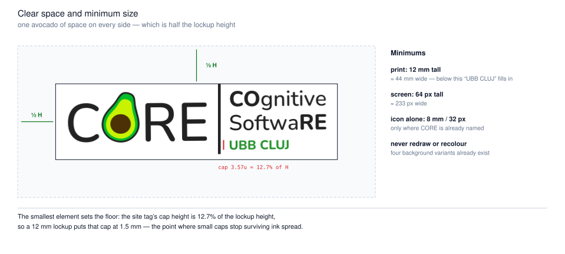
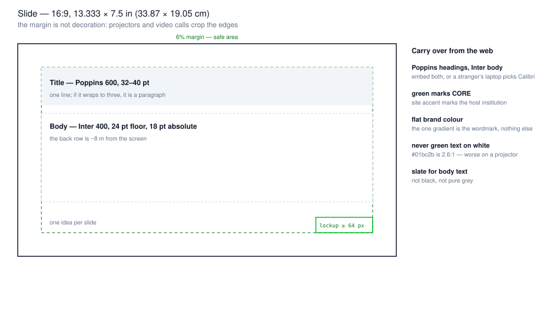
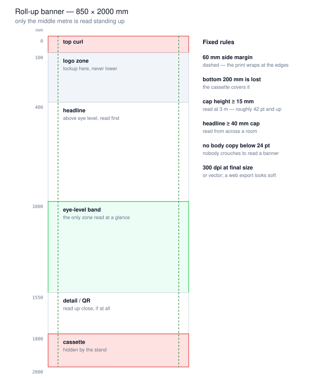

# Decks and print

How to put CORE on a slide, a roll-up, a poster or a conference handout without
rebuilding the brand by hand each time. `wiki/visual-identity.md` is the authority for
what the brand *is*; this file covers what changes when it leaves the browser.

Three things change off-screen and they cause most of the damage:

- **Nothing is clickable**, so the web's "green owns action" rule has no meaning. It is
  replaced below.
- **The viewer is further away.** A slide is read at 8 m, a roll-up at 3 m. Type sizes
  that work in a dense UI vanish.
- **Colour is not sRGB any more.** A projector crushes it and a printer converts it, and
  neither asks first.

## Read this first: there is no print colour spec

**No CMYK or Pantone values are defined for this brand anywhere.** Not in this repo, not
in the logo files — the SVGs carry sRGB hex and nothing else.

This matters because the avocado green is close to the edge of what CMYK can reproduce.
A naive conversion will come back duller than the screen colour, and the first person to
send a file to a printer will silently establish whatever the press gives them as "the
CORE green in print".

Until someone owns that decision, do this:

- **Send the printer the sRGB hex values and ask them to match**, rather than supplying
  CMYK you made up.
- For a spot-colour job, ask the printer to propose a Pantone against `#01BC2B` and
  record what they pick **in this file**.
- The conversions below are a **starting point for that conversation**, not a spec. They
  are naive sRGB→CMYK with no ICC profile, so they ignore paper, ink and press entirely.

| token | sRGB | naive C M Y K | |
|---|---|---|---|
| `primary-500` avocado | `#01BC2B` | 99 / 0 / 77 / 26 | the logo green |
| `primary-700` | `#09781B` | 93 / 0 / 78 / 53 | green that works as text |
| `secondary-300` lime | `#C8F200` | 17 / 0 / 100 / 5 | |
| `tertiary-600` pit brown | `#4C3006` | 0 / 37 / 92 / 70 | |
| UBB seal | `#034E84` | 98 / 41 / 0 / 48 | Babeș-Bolyai's own mark |

Large flat areas of `#01BC2B` are the risky case. A green rule or a small mark converts
acceptably; a full green background does not, and will band.

## Which logo file

All of them live in `public/logos/core/`, as vector SVG — which is what you want for
print. Never export a raster and scale it up.

**Pick the lockup by who is speaking:**

| file | use when |
|---|---|
| `core.svg` | CORE Network as a whole. 114 × 37 units, no site tag. |
| `core_tuc.svg` | the deck is from Goslar |
| `core_ubb.svg` | the deck is from Cluj |
| `core_ura.svg` | the deck is from Rostock |
| `avocando-icon.svg` | mark only — see the size floor below |

**Then pick the folder by the background you are placing it on:**

| folder | background |
|---|---|
| `white-background/` | pure white |
| `light-background/` | any light tint or photo highlight |
| `dark-background/` | dark slate, deep photos |
| `black-background/` | true black |

These are not the same file recoloured wholesale. **The avocado is identical in all
four** — `#01BC2B`, `#C8F200`, `#4C3006` — and only the wordmark ink and the site tag
move, so the tag keeps its contrast against each background:

| variant | wordmark | site tag |
|---|---|---|
| white-background | `#333333` | `#2D8F35` |
| light-background | `#222222` | `#28942E` |
| dark-background | `#EEEEEE` | `#35A33C` |
| black-background | `#F1F1F1` | `#3DB845` |

So: **do not recolour the mark to fit a background — change which file you used.** And
never take anything from `public/logos/core/legacy/`; those are superseded raster files
kept only for history.

### Clear space and minimum size



**Clear space is half the lockup height on every side** — which happens to be almost
exactly the height of the avocado, so the usable version of the rule is *keep one avocado
of space around it*. Nothing enters that box: no photo edge, no partner logo, no caption.

**Minimum size is set by the smallest thing in the lockup**, which is the site tag. Its
cap height is 12.7% of the total lockup height, so:

- **print: 12 mm tall** (≈ 44 mm wide) — that puts the tag's caps at 1.5 mm, about where
  small caps stop surviving ink spread on coated stock.
- **screen or slide: 64 px tall** (≈ 233 px wide).
- **icon alone: 8 mm / 32 px**, and only where the word CORE already appears nearby.

Below those sizes use `core.svg`, which has no site tag, or the icon alone.

## Type

**Poppins 600–800** for headings, **Inter 300–700** for everything else — the same pair
the site uses. Both ship under the SIL Open Font License, which permits embedding in a
document.

The failure mode is specific and common: **you send a `.pptx`, the other machine does not
have Poppins, PowerPoint silently substitutes Calibri, and every heading reflows.** You
will not see it; they will.

- **Embed the fonts** in the file when your PowerPoint offers it.
- **If you cannot embed, send a PDF.** For anything you are not personally presenting,
  send a PDF anyway.
- **For print, convert type to outlines** before handing files to a printer, or supply
  the font files with the artwork.
- Never substitute by hand. Arial is not a fallback for Poppins; it changes the voice.

Do not carry the web's type scale across. The site is deliberately UI-dense — `text-sm`
and `text-xs` are about half of all its sizing — and every one of those sizes is
unreadable projected.

## Slides



16:9, 13.333 × 7.5 in (33.87 × 19.05 cm) — PowerPoint's Widescreen default; do not change
it.

- **6% margin on all four sides, and treat it as real.** Projectors overscan, video calls
  crop, and room screens are rarely the aspect you designed for.
- **Title: Poppins 600, 32–40 pt.** One line. A title that wraps to three lines is a
  paragraph that has not admitted it yet.
- **Body: Inter 400, 24 pt floor, 18 pt absolute minimum.** The back row is roughly 8 m
  from the screen.
- **Lockup bottom-right**, at least 64 px tall, inside the margin. One per slide, and not
  on the title slide if the title slide is already the logo.
- **One idea per slide.**

### Colour on a projector

Projectors lose contrast badly — ambient light raises the black level, so *everything*
compresses toward mid-grey. Ratios that pass on a monitor can fail in the room.

- **Never set text in `primary-500` `#01BC2B`.** It is 2.55:1 on white before the
  projector gets involved. This is already the rule on the web; a projector makes it
  worse, not better.
- **Body text is `slate-900` on white**, or white on `slate-950`. Not pure black on pure
  white — it glares.
- **Green is for marks, rules, and small fills**, at `primary-700` or darker when it
  carries a word.
- **Go darker than feels right on a laptop.** If you are choosing between two steps, take
  the darker one.

## Roll-ups and posters



850 × 2000 mm is the standard European roll-up. **Confirm the exact print size and bleed
with the vendor before designing** — cassette depth and bleed allowance vary by hardware,
and this is the one number here that is not ours to set.

The geometry that does not vary:

- **The bottom 200 mm is gone.** The cassette covers it. Anything there — a partner logo
  strip, a URL — will not exist.
- **The top ~100 mm curls back** as the banner leans on its stand. Nothing critical.
- **1000–1550 mm is the only zone read at a glance.** That is standing eye level. The
  single most important sentence goes there, not at the top.
- **60 mm side margins.** The print wraps slightly at the edges.
- **Logo in the 100–400 mm band**, never at the bottom where it will be half-eaten.

Type, from the viewing-distance rule *cap height ≥ distance / 200*:

| read from | minimum cap height |
|---|---|
| 0.5 m (handout) | 3 mm |
| 1 m | 5 mm |
| 2 m | 10 mm |
| 3 m (roll-up) | 15 mm ≈ 42 pt |
| 5 m | 25 mm |

Headline caps at 40 mm or more. No body copy under 24 pt — nobody crouches to read a
banner. Export at 300 dpi **at final size**, or keep it vector; a web-resolution asset
enlarged to 2 m looks exactly as bad as it sounds.

## What carries over, and what replaces it

Most of `wiki/visual-identity.md` applies unchanged. Two rules need translating:

**"Green owns action, the site accent owns place"** — there is no action off-screen. It
becomes:

> **Green says CORE. The site accent says which institution is hosting.** A Cluj deck may
> use the UBB seal blue `#034E84` for section marks and rules; the CORE green stays on
> the mark and the structural elements. A deck that is not from a specific lab uses green
> only.

**"The partnership gradient"** survives intact and is still the single exception to flat
brand colour: host's mark sweeping to CORE's, on a wordmark, once. Everything else is
flat. No gradient-filled shapes, no gradient backgrounds, no gradient text that is not
the wordmark.

Also unchanged: **slate for neutrals** (never Tailwind `gray`, never pure grey), pills and
`2xl`-ish rounded corners rather than sharp boxes, and photography that is actually ours.

## Before you send it

- [ ] Right lockup for who is speaking, right background variant for what is behind it
- [ ] Clear space respected — one avocado on every side
- [ ] Logo at or above the size floor (12 mm print / 64 px screen)
- [ ] No text set in `primary-500`
- [ ] Fonts embedded, or exported to PDF
- [ ] Nothing important in the bottom 200 mm of a roll-up
- [ ] 300 dpi at final size, or vector
- [ ] Printer briefed with sRGB hex, not invented CMYK

## Figures

Regenerate after changing any dimension or brand colour, and commit the SVGs with the
change:

```bash
node scripts/print-figures.mjs
```

The script pulls brand colours out of `src/index.css` and embeds the real
`core_ubb.svg` rather than redrawing it, so the figures cannot drift from what ships.
Layout constants (banner size, slide size, margins) live at the top of each function.

## Still open

- **Nobody owns print colour.** CMYK and Pantone are undefined; see the top of this file.
  Record the answer here once a printer has matched it.
- **There is no deck template.** No `.pptx` or `.potx` exists in the repo. Everything
  above is written so a deck can be built by hand, but a template would remove most of
  the ways to get it wrong. Worth building once the colour question is settled, since the
  template would bake in whatever is decided.
- **Roll-up vendor spec unconfirmed.** The 850 × 2000 mm and 200 mm cassette figures are
  the common case, not a measured one from a specific supplier.
