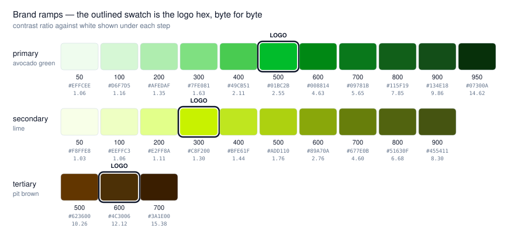
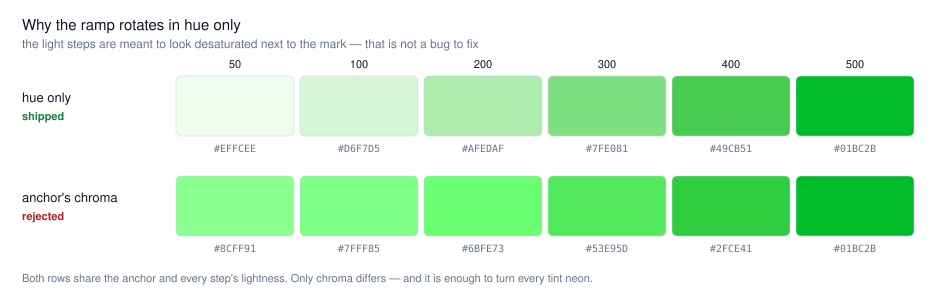
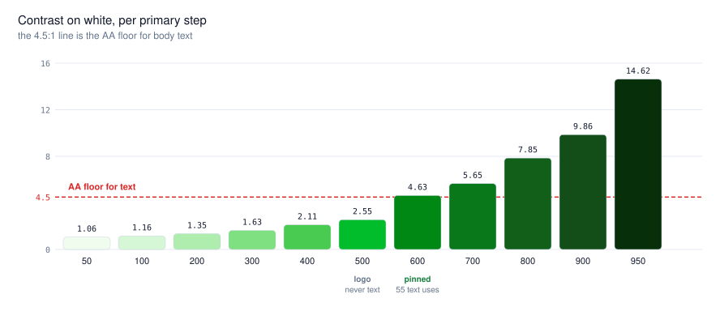

# Visual identity

The colour, type and shape rules this site actually follows, and the reasoning that
fixes them in place. Read this before changing a brand colour, adding a colour family,
or "tidying" a palette — several of the values here look arbitrary and are not.

## Why this exists

The palette and the logo drifted apart. The logo SVGs shipped `#01BC2B`, `#C8F200` and
`#4C3006`; the nearest CSS token to each sat 17–24 RGB units away, so brand-coloured UI
rendered in a visibly different green from the mark beside it. Nothing in the repo
recorded which of the two was authoritative, so the drift survived every restyle. It is
resolved below, and the rule is written down so it does not re-open.

## The authority rule

**The logo SVGs in `public/logos/core/` are the source of truth for brand colour.** They
exist in partner decks, print and external material; the CSS does not. When the palette
and the mark disagree, the palette moves.

`src/index.css` `:root` is the single definition of that palette.
`tailwind.config.js` only maps it (`rgb(var(--primary-600) / <alpha-value>)`) — there are
no colour literals there, and none should be added.

### The vars cannot be inlined

The `rgb(var(--x))` indirection outlived the runtime theme switcher it was built for, so
it looks vestigial. It is not: ten call sites read the variables from **raw CSS**, outside
Tailwind's reach — the `.range-dual` slider thumb in `index.css`, and the inline `<style>`
blocks in `pages/tuc/Teaching.jsx`. Collapsing the variables into the Tailwind theme
breaks all ten silently.

## Colour

### Anchors — exact logo hexes

One step per family **is** the logo colour, byte for byte:

| family | anchor | hex | contrast on white |
|---|---|---|---|
| `primary` (avocado green) | `--primary-500` | `#01BC2B` | 2.55:1 |
| `secondary` (lime) | `--secondary-300` | `#C8F200` | 1.30:1 |
| `tertiary` (pit brown) | `--tertiary-600` | `#4C3006` | 12.12:1 |



The anchor sits at the step whose **luminance already matched** the logo colour, which is
why the ramps stay smooth across it. That placement is derived, not chosen — if a logo
colour ever changes, recompute the position rather than keeping the old step.

### Regenerating a ramp — hue only

Every non-anchor step keeps the **lightness and chroma it already has** and rotates only
in hue toward the anchor. This is the rule that preserves contrast: lightness is what
drives contrast ratio, so leaving it untouched means no step silently drops below its
threshold.

**Do not pull the light steps toward the anchor's saturation.** This was tried first and
is the obvious-looking mistake: the logo green is intensely chromatic, and propagating
that chroma up the ramp blows the tints out to neon, wrecking every soft background wash
on the site. The 50–200 steps are *supposed* to look desaturated next to the mark.



Both rows above share the same anchor and the same per-step lightness. Chroma is the only
difference between them.

Working in OKLab (not HSL — HSL's "lightness" is not perceptual and will shift contrast):

```js
// the target hue, taken once from the logo colour
const [, logoA, logoB] = rgb2oklab(logoHex)
const hue = Math.atan2(logoB, logoA)

// rotate a token to that hue, keeping its own lightness and chroma
const [L, a, b] = rgb2oklab(currentToken)
const C = Math.hypot(a, b)
const realigned = oklab2rgb([L, C * Math.cos(hue), C * Math.sin(hue)])
```

After regenerating, check three invariants: every ramp still darkens monotonically, every
anchor still equals its logo hex exactly, and no text-bearing step fell under 4.5:1.

### `--primary-600` is a deliberate exception

It is darkened **past** its hue-only value, to `#008814` / 4.63:1. It carries 55
`text-primary-600` uses and sat at 4.19:1 — already under the 4.5:1 AA floor before any
of this work. Constraints if you touch it: keep it **≥ 4.5:1 on white** and keep its
luminance **between 500 and 700**, or the ramp stops being monotonic.



`primary-600` and `primary-700` together carry 225 of the 448 brand-colour utility uses
on the site. They are the buttons and the link text; treat them as load-bearing.

`--primary-500` is the opposite case: at 2.55:1 it fails AA, and that is accepted because
24 of its 25 uses are backgrounds, rings and borders. Do not start using it for text.
Note `bg-primary-500` with white text on it does not reach AA either.

### Neutrals — slate only

**One neutral ramp: `slate`.** 895 uses. `gray` is gone and should not come back.

They were previously mixed — 403 gray against 492 slate, colliding *inside* single files
(`TempoProject.jsx` ran 31 slate against 37 gray). Tailwind's `gray` is warmer than its
`slate`; pairing them in one card gives subtly mismatched borders and body copy. There
was no core/tuc split to preserve — both ramps appeared throughout both subtrees.

### There is no accent family

An amber `accent` triplet was removed, not renamed. It was hardcoded rather than
themeable, bore no relationship to the logo, and **every shade failed AA** — its two call
sites ran white-on-amber at 2.19:1 and amber-on-white at 2.15:1, with no darker step in
the family to escape to.

If something needs to read as "not the primary green", reach for `secondary-700`
(4.60:1) — that is what the `PublicationItem` code link uses to stay distinct from the
green paper link beside it. Do not reintroduce a colour family that sits outside the
logo.

## Typography

- **Poppins 600–800** — all headings. Applied once, via a base-layer `h1…h6` rule in
  `index.css`. Do not add `font-heading` per-heading.
- **Inter 300–700** — body, and the default.
- Both load from Google Fonts in `index.html` and are render-blocking.

The real scale is UI-dense rather than editorial: `text-sm` and `text-xs` account for
roughly half of all sizing utilities. Display sizes (`text-5xl`+) appear only in heroes.

Project subpages deliberately narrow this further — Inter only, no Poppins, plus
`font-mono` for data. See `wiki/project-subsites.md`, which wins on those routes.

## Shape and motion

- **Pills dominate.** `rounded-full` is the single most common radius (122 uses) — the
  navbar, badges, chips, CTAs. Cards sit at `rounded-2xl`, with `xl` and `lg` below.
- **Hover is colour-first**: `transition-colors` at 200–300 ms, often with
  `group-hover:scale-*` on an image inside the card.
- Gradients are used as scrims and tints (`to-br`, `to-t`), never as brand fills — the
  brand colour is flat.
- Framer Motion appears in 10 files, for entrance animation only.

## Changing a brand colour — procedure

1. Edit the logo SVGs in `public/logos/core/` first. They are the authority.
2. Recompute which ramp step matches the new colour's luminance; that becomes the anchor.
3. Regenerate the other steps hue-only (above). Do not hand-pick them.
4. Re-check the invariants: monotonic ramps, anchors exact, text steps ≥ 4.5:1,
   `primary-600` between 500 and 700.
5. Update the comment block above `:root` in `index.css` — it states the anchors and the
   AA constraint, and a stale copy there is worse than none.
6. Redraw the figures in this doc and commit them with the change:

   ```bash
   node scripts/palette-figures.mjs
   ```

   The script reads the palette straight out of `index.css`, so the figures cannot
   disagree with what ships — but only if it is re-run. If you add a family or a step,
   the anchor table in `scripts/palette-figures.mjs` needs the new entry too.
7. Verify in a browser, not just `npm run build`. Read the computed value of the
   variables off `document.documentElement`; a build pass proves nothing about colour.

## Gotcha: classes Tailwind never emits

`border-gray-250` lived in `ComputeCluster.jsx` for a long time. 250 is not a Tailwind
shade, so **the class compiled to nothing** and the border quietly fell back to the
preflight default — no error, no warning, at build or at runtime.

After changing any colour utility, confirm the new class is actually in the compiled CSS:

```bash
grep -o "\.text-secondary-700" dist/assets/*.css
```

An absent match means the utility does not exist and the element is falling back to
something you did not choose.
